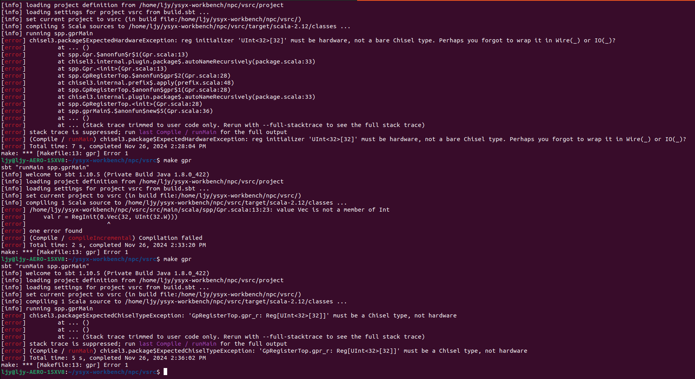
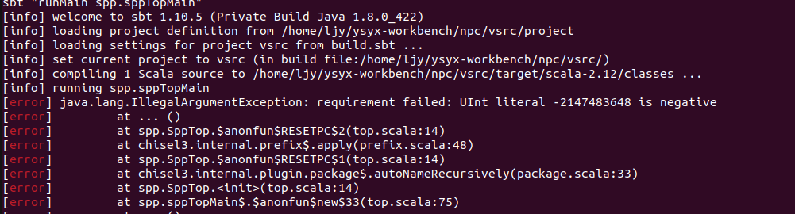

> ctrl+z : background vim, "fg" : open back

# 理解指令执行的过程
## 一条指令的历程 
`cpu_exec()`最终调用了`isa_exec_once()`.这些核心的操作,包括指令的取指与译码环节,在`isa/$ISA/inst.c`中可以找到.
- 取指:`inst_fetch()`从内存中读取定长
- 译码:`decode_exec()`匹配指令模式,为`rs1, rs2, imm`赋值,调用函数执行指令操作(想想正则表达式!)
  ```c
    INSTPAT_START();
    INSTPAT("??????? ????? ????? ??? ????? 00101 11", auipc, U, R(rd) = s->pc + imm);
    // ...
    INSTPAT_END();
  ```
  看起来这么易懂得感谢宏.看看他们原本面目:
    
    `INSTPAT`(instrution pattern)调用`pattern_decode()`函数分析当前执行指令的`pattern`;如果分析出的组成部分与预置的指令匹配, 则由`INSTPAT_MATCH()`执行`__VA_ARGS__`所述的指令解析与行为
    
    `include/cpu/decode.h`定义的`pattern_decode`将一条32-bit的指令切分成多个'图层'或'蒙版',即`key=值为1, mask=值指定, shift= opcode到最低位的距离`. 这样的三个图层被用于滤除`don't care terms`与`shift`,复现与对比指令格式. 
    回到`inst.c`. 当我们确定当前指令为某指令后,需要 (现在回上去复习一下INSTPAT的用法吧) 
    - 对操作数`R(rs1), R(rs2), imm`进行赋值: 不同类型指令操作数格式不同.值得庆幸的是,riscv操作数的位置还是很固定的
    
    注意到,读取立即数需要进行一些符号位扩展与拼接的操作(`BITS`和`SEXT`). 
    `SEXT`定义一个匿名结构体,其中包含一个名为 `n` 位宽为 `len` 的位域(`n`实际上是`int64_t`但只能用`len`位存储); 然后实例化结构体于`__x`,将输入`x`赋给`__x.n`并转换为`uint64_t`(`__x.n`的高位被截断与符号扩展)
    
    这里尤其要留心U型,B型和J型,他们的最低位不是0位(U型是组合使用于很大的立即数所以只有高位,J型用于跳转指令显然不能跳个半截); 另外, 它们身上的位数旋转使得六型指令更好地对齐了
    - 执行: 比如`R(rd) = s->pc + imm`. 有时候我们需要调用函数来写内存(`Mw`)或者写可以反复复用的宏来执行复杂的操作

## 似懂非懂
1. snpc, dnpc是什么关系?
pc指向当前指令,snpc指向下一条静态指令, dnpc动态指向
```
(Decode*) s->pc, s->snpc = pc //这里pc是cpu.pc
s->snpc++ //取指时
s->dnpc = s->snpc //解指前
cpu.pc = s->dnpc //解指后
```


> **字节序**
> 小端序=一个多位数的低位放在小地址,高位放在大地址
> 例如,I2C,SPI和网络传输使用大端序,USB和以太网使用小端序
> 具体参考深入理解计算机第二章
> 对于立即数/>1字节的内存访问,我们都应考虑字节序
> 1. 我们在x86的机器上运行riscv32的NEMU,两者都是小端序. 如果不匹配呢?考虑不同ISA的组合
> 例如运行一个大端序的ISA?x86小端序的内存需要翻转以被正确读入;在大端序机器上运行NEMU也是一样,因为两者不匹配
> 2. mips32和riscv32怎么解决一条指令(32位)放不下32位常数的问题?
>  截断?

# 增加指令以运行程序
使用`am-kernel/tests/`中的程序测试NEMU中的指令实现(验证?):
## 第一个客户程序
第一步,运行dummy.c,需要增加:`jal(j), jalr(ret), sw, addi(li, mv)`

> 遇到的问题体现RTFM的重要性:
> ret反汇编的机器码是`00008067`,但是reader里给的是按照jalr即`?010_????_?110_0111`,两者不符
> 看了riscv-spec,给的就是`func3=000`
> 结论:旧版/翻译误人!不能老是偷懒看中文的

> 然鹅还是不对.是`s->pc`溢出了吧
> 
> 果然,`immJ()`位数没数明白

现在是这样了:指令倒也不错,可是确实是HIT BAD TRAP

我们发现`ebreak`指令将`nemu_state`设为`END`,而此时BAD TRAP说明退出检查`nemu_state.halt_ret==0`没有被满足.通过ctags跳转与gdb我们可以更好地追踪,并且找到相关的变量与函数:
`utils.h`定义
```c
struct NEMU_STATE {
	int state, vaddr_t halt_pc, uint32_t halt_ret
}
```
这些正是程序结束log输出的`nemu:(HIT BAD TRAP) at pc = (halt_pc)`!
`src/engine/interpreter/hostcall.c`写入了这两个变量,文件里有两个函数:
```c
set_nemu_state(int state, vaddr_t pc, int halt_ret)
invalid_inst(vaddr_t thispc) //不能识别opcode则state=ABORT
```
现在思考:为什么`ebreak`断点要调用函数,设`state=END, halt_ret=$a0`?因为需要检查返回值是否为0来判断有无异常!
所以为什么有异常?猜测与跳转指令相关,检查指令实现将`s->pc = ?`改为`s->dnpc = ?`
完工!
## 继续增加指令
bne指令遇到的问题:由于immB()错误地对每一段扩展符号位,导致某个跳转错误形成死循环;计算pc+gdb发现问题

# npc
## npc的第一条指令:`addi`
此处放置丑陋的代码
## 自讨苦吃:与chisel斗争
1. chisel type? hardware type? 
  
  ```scala
  val r = RegInit(Vec(32, UInt(32.W))) // reg initializer 'UInt<32>[32]' must be hardware, not a bare Chisel type
  val r = RegInit(0.Vec(32, UInt(32.W))) // value Vec is not a member of Int
  val r = RegInit(0.U.asTypeOf(Vec(32, UInt(32.W)))) // GpRegisterTop.gpr_r: Reg[UInt<32>[32]]' must be a Chisel type, not hardware
  // 问题在于把(Reg)r这个硬件包裹在(bundle) gpr中 (为什么这样呢?是我这个蠢货东抄西抄)
  ```
2. UInt怎么放的是符号数??
   复位值`val RESETPC = 0x80000000.U(32.W)`,但是
  
  符号位确实是1,于是0x80000000$\rightarrow$-2147483648.怎么办呢? `val RESETPC = "h80000000".U`可以解决(顺便说一句二进制数也是这么输进去)
