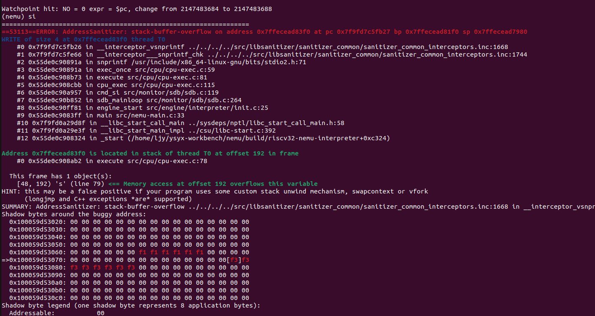

# 理解指令执行的过程
## 一条指令的历程 
`cpu_exec()`最终调用了`isa_exec_once()`.这些核心的操作,包括指令的取指与译码环节,在`isa/$ISA/inst.c`中可以找到.
- 取指:`inst_fetch()`从内存中读取定长
- 译码:`decode_exec()`匹配指令模式,为`rs1, rs2, imm`赋值,调用函数执行指令操作(想想正则表达式!)
  ```c
    INSTPAT_START();
    INSTPAT("??????? ????? ????? ??? ????? 00101 11", auipc, U, R(rd) = s->pc + imm);
    // ...
    INSTPAT_END();
  ```

  看起来这么易懂得感谢宏.看看他们原本面目:
    ```c
    // --- pattern matching wrappers for decode ---
    #define INSTPAT(pattern, ...) do { \
      uint64_t key, mask, shift; \
      pattern_decode(pattern, STRLEN(pattern), &key, &mask, &shift); \
      if ((((uint64_t)INSTPAT_INST(s) >> shift) & mask) == key) { \
        INSTPAT_MATCH(s, ##__VA_ARGS__); \
        goto *(__instpat_end); \
      } \
    } while (0)

    #define INSTPAT_START(name) { const void ** __instpat_end = &&concat(__instpat_end_, name);
    #define INSTPAT_END(name)   concat(__instpat_end_, name): ; }
    ```

    `INSTPAT`(instrution pattern)调用`pattern_decode()`函数分析当前执行指令的`pattern`;如果分析出的组成部分与预置的指令匹配, 则由`INSTPAT_MATCH()`执行`__VA_ARGS__`所述的指令解析与行为
    ```c
    // --- pattern matching mechanism ---
    __attribute__((always_inline))
    static inline void pattern_decode(const char *str, int len,
        uint64_t *key, uint64_t *mask, uint64_t *shift) {
      uint64_t __key = 0, __mask = 0, __shift = 0;
    #define macro(i) \
      if ((i) >= len) goto finish; \
      else { \
        char c = str[i]; \
        if (c != ' ') { \
          Assert(c == '0' || c == '1' || c == '?', \
              "invalid character '%c' in pattern string", c); \
          __key  = (__key  << 1) | (c == '1' ? 1 : 0); \
          __mask = (__mask << 1) | (c == '?' ? 0 : 1); \
          __shift = (c == '?' ? __shift + 1 : 0); \
        } \
      }
    ```

    `include/cpu/decode.h`定义的`pattern_decode`将一条32-bit的指令切分成多个'图层'或'蒙版',即`key=值为1, mask=值指定, shift= opcode到最低位的距离`. 这样的三个图层被用于滤除`don't care terms`与`shift`,复现与对比指令格式. 
    回到`inst.c`. 当我们确定当前指令为某指令后,需要 (现在回上去复习一下INSTPAT的用法吧) 
    - 对操作数`R(rs1), R(rs2), imm`进行赋值: 不同类型指令操作数格式不同.值得庆幸的是,riscv操作数的位置还是很固定的
    ```c
    #define src1R() do { *src1 = R(rs1); } while (0)
    #define src2R() do { *src2 = R(rs2); } while (0)
    #define immI() do { *imm = SEXT(BITS(i, 31, 20), 12); } while(0)
    #define immU() do { *imm = SEXT(BITS(i, 31, 12), 20) << 12; } while(0)
    #define immB() do { *imm = (SEXT(BITS(i, 31, 31), 1) << 12) | (BITS(i, 7, 7) << 11) \
    	| (BITS(i, 30, 25) << 5) | (BITS(i, 11, 8) << 1); } while(0)
    #define immS() do { *imm = (SEXT(BITS(i, 31, 25), 7) << 5) | BITS(i, 11, 7); } while(0)
    #define immJ() do { *imm = (SEXT(BITS(i, 31, 31), 1) << 20) | (BITS(i, 19, 12) << 12) \
    	| (BITS(i, 20, 20) << 11) | (BITS(i, 30, 21) << 1); } while(0)

    static void decode_operand(Decode *s, int *rd, word_t *src1, word_t *src2, word_t *imm, int type) {
    	uint32_t i = s->isa.inst.val;
    	int rs1 = BITS(i, 19, 15);
    	int rs2 = BITS(i, 24, 20);
    	*rd     = BITS(i, 11, 7);
    	switch (type) {
    		case TYPE_R: src1R(); src2R();		   break;
    		case TYPE_I: src1R();          immI(); break;
    		case TYPE_U:                   immU(); break;
    		case TYPE_B: src1R(); src2R(); immB(); break;
    		case TYPE_S: src1R(); src2R(); immS(); break;
    		case TYPE_J:				   immJ(); break;
    	}
    }
    ```

    > 注意到,读取立即数需要进行一些符号位扩展与拼接的操作(`BITS`和`SEXT`, 在`include/macro.h`定义). 
    > `SEXT`定义一个匿名结构体,其中包含一个名为 `n` 位宽为 `len` 的位域(`n`实际上是`int64_t`但只能用`len`位存储); 然后实例化结构体于`__x`,将输入`x`赋给`__x.n`并转换为`uint64_t`(`__x.n`的高位被截断与符号扩展)
    > ```c
    > #define BITMASK(bits) ((1ull << (bits)) - 1)
    > #define BITS(x, hi, lo) (((x) >> (lo)) & BITMASK((hi) - (lo) + 1)) // similar to x[hi:lo] in verilog
    > #define SEXT(x, len) ({ struct { int64_t n : len; } __x = { .n = x }; (uint64_t)__x.n; })
    > ```
    > 这里尤其要留心U型,B型和J型,他们的最低位不是0位(U型是组合使用于很大的立即数所以只有高位,J型用于跳转指令显然不能跳个半截); 另外, 它们身上的位数旋转使得六型指令更好地对齐了
    - 执行: 比如`R(rd) = s->pc + imm`. 有时候我们需要调用函数来写内存(`Mw`)或者写可以反复复用的宏来执行复杂的操作

## 似懂非懂
1. snpc, dnpc是什么关系?
  pc指向当前指令,snpc指向下一条静态指令, dnpc动态指向
  ```
  (Decode*) s->pc, s->snpc = pc //这里pc是cpu.pc
  s->snpc++ //取指时
  s->dnpc = s->snpc //解指前
  cpu.pc = s->dnpc //解指后
  ```


> **字节序**
> 小端序=一个多位数的低位放在小地址,高位放在大地址
> 例如,I2C,SPI和网络传输使用大端序,USB和以太网使用小端序
> 具体参考深入理解计算机第二章
> 对于立即数/>1字节的内存访问,我们都应考虑字节序
> 1. 我们在x86的机器上运行riscv32的NEMU,两者都是小端序. 如果不匹配呢?考虑不同ISA的组合
> 例如运行一个大端序的ISA?x86小端序的内存需要翻转以被正确读入;在大端序机器上运行NEMU也是一样,因为两者不匹配
> 2. mips32和riscv32怎么解决一条指令(32位)放不下32位常数的问题?
>  截断?

# 增加指令以运行程序
使用`am-kernel/tests/`中的程序测试NEMU中的指令实现(验证?):
## 第一个客户程序
第一步,运行dummy.c,需要增加:`jal(j), jalr(ret), sw, addi(li, mv)`

> 遇到的问题体现RTFM的重要性:
> ret反汇编的机器码是`00008067`,但是reader里给的是按照jalr即`?010_????_?110_0111`,两者不符
> 看了riscv-spec,给的就是`func3=000`
> 结论:旧版/翻译误人!不能老是偷懒看中文的

> 然鹅还是不对.是`s->pc`溢出了吧
> 
> 果然,`immJ()`位数没数明白

现在是这样了:指令倒也不错,可是确实是HIT BAD TRAP

我们发现`ebreak`指令将`nemu_state`设为`END`,而此时BAD TRAP说明退出检查`nemu_state.halt_ret==0`没有被满足.通过ctags跳转与gdb我们可以更好地追踪,并且找到相关的变量与函数:
`utils.h`定义
```c
struct NEMU_STATE {
	int state, vaddr_t halt_pc, uint32_t halt_ret
}
```
这些正是程序结束log输出的`nemu:(HIT BAD TRAP) at pc = (halt_pc)`!
`src/engine/interpreter/hostcall.c`写入了这两个变量,文件里有两个函数:
```c
set_nemu_state(int state, vaddr_t pc, int halt_ret)
invalid_inst(vaddr_t thispc) //不能识别opcode则state=ABORT
```
现在思考:为什么`ebreak`断点要调用函数,设`state=END, halt_ret=$a0`?因为需要检查返回值是否为0来判断有无异常!
所以为什么有异常?猜测与跳转指令相关,检查指令实现将`s->pc = ?`改为`s->dnpc = ?`
完工!
## 继续增加指令
bne指令遇到的问题:由于immB()错误地对每一段扩展符号位,导致某个跳转错误形成死循环;计算pc+gdb发现问题


---
最终成品(这里用了很原始的办法来处理有符号运算, 事实上可以直接类型转换):
```c
	/* R type */
	INSTPAT("0000000 ????? ????? 000 ????? 01100 11", add    , R, R(rd) = src1 + src2);
	INSTPAT("0100000 ????? ????? 000 ????? 01100 11", sub    , R, R(rd) = src1 - src2); // neg
	INSTPAT("0000001 ????? ????? 000 ????? 01100 11", mul    , R, R(rd) = src1 * src2);
	INSTPAT("0000001 ????? ????? 001 ????? 01100 11", mulh   , R, R(rd) = ((int64_t)(sword_t)src1 * (sword_t)src2 >> 32)); // signed?
	INSTPAT("0000001 ????? ????? 100 ????? 01100 11", div    , R, R(rd) = (sword_t)src1 / (sword_t)src2);
	INSTPAT("0000001 ????? ????? 101 ????? 01100 11", divu   , R, R(rd) = src1 / src2);
	INSTPAT("0000001 ????? ????? 110 ????? 01100 11", rem    , R, R(rd) = (sword_t)src1 % (sword_t)src2);
	INSTPAT("0000001 ????? ????? 111 ????? 01100 11", remu   , R, R(rd) = src1 % src2);

	INSTPAT("0000000 ????? ????? 111 ????? 01100 11", and    , R, R(rd) = src1 & src2);
	INSTPAT("0000000 ????? ????? 110 ????? 01100 11", or     , R, R(rd) = src1 | src2);
	INSTPAT("0000000 ????? ????? 100 ????? 01100 11", xor    , R, R(rd) = src1 ^ src2);

	INSTPAT("0000000 ????? ????? 001 ????? 01100 11", sll    , R, R(rd) = src1 << src2);

	INSTPAT("0000000 ????? ????? 011 ????? 01100 11", sltu   , R, R(rd) = (src1 < src2)); // snez
	INSTPAT("0000000 ????? ????? 010 ????? 01100 11", slt    , R, R(rd) = (src1 < src2) && (BITS(src1, 31, 31) == BITS(src2, 31, 31))); 
	/* U type */
	INSTPAT("??????? ????? ????? ??? ????? 00101 11", auipc  , U, R(rd) = s->pc + imm);
	INSTPAT("??????? ????? ????? ??? ????? 01101 11", lui    , U, R(rd) = imm);

	/* I type */
	// load from memory
	INSTPAT("??????? ????? ????? 100 ????? 00000 11", lbu    , I, R(rd) = Mr(src1 + imm, 1));
	INSTPAT("??????? ????? ????? 001 ????? 00000 11", lh     , I, R(rd) = SEXT(Mr(src1 + imm, 2), 16));
	INSTPAT("??????? ????? ????? 101 ????? 00000 11", lhu    , I, R(rd) = Mr(src1 + imm, 2));
	INSTPAT("??????? ????? ????? 010 ????? 00000 11", lw     , I, R(rd) = Mr(src1 + imm, 4)); 
#define Add(r, a, b) (r = a + b)
#define Jalr(r, a, offset) (r = s->pc + 4, s->dnpc = (a + offset)&(-1))
	INSTPAT("??????? ????? ????? 000 ????? 00100 11", addi   , I, Add(R(rd), src1, imm)); // mv == addi
																						  // li == lui or addi in RV32I																						  
	INSTPAT("??????? ????? ????? 111 ????? 00100 11", andi   , I, R(rd) = src1 & imm); // zext.b
	INSTPAT("??????? ????? ????? 100 ????? 00100 11", xori   , I, R(rd) = src1 ^ imm); // not == xori -1
	INSTPAT("0000000 ????? ????? 001 ????? 00100 11", slli   , I, R(rd) = src1 << imm); 
	INSTPAT("0000000 ????? ????? 101 ????? 00100 11", srli   , I, R(rd) = src1 >> imm); 
#define SEXT_varlen(n, move) ( (BITS(n, 31, 31) == 1)? ((n >> move) | (~0 << (32-move))) : (n >> move) )
	INSTPAT("0100000 ????? ????? 101 ????? 00100 11", srai   , I, R(rd) = SEXT_varlen(src1, (imm&0x1f)) );//SEXT_varlen(src1, 0x1f & imm)); 

	INSTPAT("??????? ????? ????? 000 ????? 11001 11", jalr   , I, Jalr(R(rd), src1, imm));  // return, ret == jalr x0, x1, 0
	
	INSTPAT("??????? ????? ????? 011 ????? 00100 11", sltiu  , I, R(rd) = (src1 < imm)); // compare as unsigned
																						 // seqz == sltiu rd rs1 1

	/* B type */
#define CheckEq(r1, r2) (r1 == r2)
#define CheckNeq(r1, r2) (CheckEq(r1, r2) == 0 )
#define CheckLess(r1, r2) (((r1 < r2)&&(BITS(r1, 31, 31)==BITS(r2, 31, 31))) \
		|| ((r1 > r2)&&(BITS(r1, 31, 31)== 1)&&(BITS(r2, 31, 31)==0)) )
#define CheckGE(r1, r2) (CheckLess(r1, r2) == 0 )
#define Branch(condition, offset) (s->dnpc = condition? s->pc + offset : s->dnpc )
	INSTPAT("??????? ????? ????? 000 ????? 11000 11", beq    , B, Branch(CheckEq(src1, src2), imm));// beqz = beq(src1, R(0), imm)); 
	INSTPAT("??????? ????? ????? 001 ????? 11000 11", bne    , B, Branch(CheckNeq(src1, src2), imm)); 

	INSTPAT("??????? ????? ????? 100 ????? 11000 11", blt    , B, Branch(CheckLess(src1, src2), imm)); // compared as signed
	INSTPAT("??????? ????? ????? 110 ????? 11000 11", bltu   , B, Branch((src1 < src2), imm)); 
	INSTPAT("??????? ????? ????? 101 ????? 11000 11", bge    , B, Branch(CheckGE(src1, src2), imm)); 
	INSTPAT("??????? ????? ????? 111 ????? 11000 11", bgeu   , B, Branch((src1 >= src2), imm)); 

	/* S store byte/halfword/word */
	INSTPAT("??????? ????? ????? 000 ????? 01000 11", sb     , S, Mw(src1 + imm, 1, src2));
	INSTPAT("??????? ????? ????? 001 ????? 01000 11", sh     , S, Mw(src1 + imm, 2, src2));
	INSTPAT("??????? ????? ????? 010 ????? 01000 11", sw     , S, Mw(src1 + imm, 4, src2));

	/* J unconditional jump */
#define Jal(r, offset) (r = s->pc + 4, s->dnpc = s->pc + offset)
	INSTPAT("??????? ????? ????? ??? ????? 11011 11", jal    , J, Jal(R(rd), imm)); // j = jal(R(0), imm)

	INSTPAT("0000000 00001 00000 000 00000 11100 11", ebreak , N, NEMUTRAP(s->pc, R(10))); // R(10) = $a0, function return
	INSTPAT("??????? ????? ????? ??? ????? ????? ??", inv    , N, INV(s->pc));
```

# 运行时环境与abstract-machine
## 程序运行在不同的架构与平台上

> - Runtime environment  提供执行代码环境的软件平台 	
> - Engine 通过编译或解释来执行代码的运行时环境的组件	
> - Interpreter 逐行读取并执行代码，无需事先编译整个程序的引擎类型


- 运行时环境是什么? 提供执行代码环境的软件平台,解决了内存管理、程序访问变量、过程之间传递参数的机制、接口等问题
- 这里, 运行时环境以库的形式存在. 运行程序所需要的公共要素(比如`halt()`)被抽象成API, 不同的架构各自实现API, 需要的时候只要调用这些API, 就能使用运行时环境提供的相应功能.
  流程: `(在NEMU中)实现硬件功能 -> (在AM中)提供运行时环境 -> (在APP层)运行程序`


## 读一下AM的Makefile
1. Basic Setup and Checks
  ```makefile
  ### Default to create a bare-metal kernel image
  ifeq ($(MAKECMDGOALS),)
    MAKECMDGOALS  = image
    .DEFAULT_GOAL = image
  endif
  ### 检查:查找am.h文件以判断环境变量`$AM_HOME`是否正确
  ifeq ($(wildcard $(AM_HOME)/am/include/am.h),)
    $(error $$AM_HOME must be an AbstractMachine repo)
  endif
  ### 检查:查找*.mk文件,提取出文件名(notdir去除路径,basename只保留文件名去除后缀), 从而比较输入的$(ARCH)是否匹配*.mk文件给定的ISA-平台组合列表
  ARCHS = $(basename $(notdir $(shell ls $(AM_HOME)/scripts/*.mk)))
  ifeq ($(filter $(ARCHS), $(ARCH)), )
    $(error Expected $$ARCH in {$(ARCHS)}, Got "$(ARCH)")
  endif
  ### 替换-为空格, 并拆分出ISA与PLATFORM变量; 例如: `ARCH=x86_64-qemu -> ISA=x86_64; PLATFORM=qemu`
  ARCH_SPLIT = $(subst -, ,$(ARCH))
  ISA        = $(word 1,$(ARCH_SPLIT))
  PLATFORM   = $(word 2,$(ARCH_SPLIT))
  ### 检查: 查询$SRCS的flavor特性,是否等于undefined(flavor是变量赋值与使用值的方式,包括undefined,recursive,simple)
  ### 如果$SRCS没有赋值(nothing to build),报错
  ifeq ($(flavor SRCS), undefined)
    $(error Nothing to build)
  endif
  ```

2. General Compilation Targets
  ```makefile
  ### Create the destination directory (`build/$ARCH`)
  WORK_DIR  = $(shell pwd)
  DST_DIR   = $(WORK_DIR)/build/$(ARCH)
  $(shell mkdir -p $(DST_DIR))

  ### Compilation targets (a binary image or archive)
  ### 可执行文件?与静态库的生成目标地址
  IMAGE_REL = build/$(NAME)-$(ARCH)
  IMAGE     = $(abspath $(IMAGE_REL))
  ARCHIVE   = $(WORK_DIR)/build/$(NAME)-$(ARCH).a

  ### Collect the files to be linked: object files (`.o`) and libraries (`.a`)
  ### 将am-$ISA-nemu.a,应用程序源文件编译的目标文件,程序依赖的运行库(如abstract-machine/klib/)收集打包成归档文件
  OBJS      = $(addprefix $(DST_DIR)/, $(addsuffix .o, $(basename $(SRCS))))
  LIBS     := $(sort $(LIBS) am klib) # lazy evaluation ("=") causes infinite recursions
  LINKAGE   = $(OBJS) \
    $(addsuffix -$(ARCH).a, $(join \
      $(addsuffix /build/, $(addprefix $(AM_HOME)/, $(LIBS))), \
      $(LIBS) ))
  ```

3. General Compilation Flags
  ```makefile
  ### 交叉编译 e.g., mips-linux-gnu-g++
  AS        = $(CROSS_COMPILE)gcc
  CC        = $(CROSS_COMPILE)gcc
  CXX       = $(CROSS_COMPILE)g++
  LD        = $(CROSS_COMPILE)ld
  AR        = $(CROSS_COMPILE)ar
  OBJDUMP   = $(CROSS_COMPILE)objdump
  OBJCOPY   = $(CROSS_COMPILE)objcopy
  READELF   = $(CROSS_COMPILE)readelf

  ### Compilation flags
  INC_PATH += $(WORK_DIR)/include $(addsuffix /include/, $(addprefix $(AM_HOME)/, $(LIBS)))
  INCFLAGS += $(addprefix -I, $(INC_PATH))

  ARCH_H := arch/$(ARCH).h
  CFLAGS   += -O2 -MMD -Wall -Werror $(INCFLAGS) \
              -D__ISA__=\"$(ISA)\" -D__ISA_$(shell echo $(ISA) | tr a-z A-Z)__ \
              -D__ARCH__=$(ARCH) -D__ARCH_$(shell echo $(ARCH) | tr a-z A-Z | tr - _) \
              -D__PLATFORM__=$(PLATFORM) -D__PLATFORM_$(shell echo $(PLATFORM) | tr a-z A-Z | tr - _) \
              -DARCH_H=\"$(ARCH_H)\" \
              -fno-asynchronous-unwind-tables -fno-builtin -fno-stack-protector \
              -Wno-main -U_FORTIFY_SOURCE -fvisibility=hidden
  CXXFLAGS +=  $(CFLAGS) -ffreestanding -fno-rtti -fno-exceptions
  ASFLAGS  += -MMD $(INCFLAGS)
  LDFLAGS  += -z noexecstack
  ```

4. Arch-Specific Configurations
  ```makefile
  ### Paste in arch-specific configurations (e.g., from `scripts/x86_64-qemu.mk`)
  -include $(AM_HOME)/scripts/$(ARCH).mk

  ### Fall back to native gcc/binutils if there is no cross compiler
  ifeq ($(wildcard $(shell which $(CC))),)
    $(info #  $(CC) not found; fall back to default gcc and binutils)
    CROSS_COMPILE :=
  endif
  ```
5. Compilation Rules
  ```makefile
  ### Rule (compile): a single `.c` -> `.o` (gcc)

  ### &&(shell AND): 如果前者失败,不会运行后者; $@: 所有参数, $<: 第一个参数?
  $(DST_DIR)/%.o: %.c
  	@mkdir -p $(dir $@) && echo + CC $< 
  	@$(CC) -std=gnu11 $(CFLAGS) -c -o $@ $(realpath $<)

  ### Rule (compile): a single `.cc` -> `.o` (g++)
  $(DST_DIR)/%.o: %.cc
  	@mkdir -p $(dir $@) && echo + CXX $<
  	@$(CXX) -std=c++17 $(CXXFLAGS) -c -o $@ $(realpath $<)

  ### Rule (compile): a single `.cpp` -> `.o` (g++)
  $(DST_DIR)/%.o: %.cpp
  	@mkdir -p $(dir $@) && echo + CXX $<
  	@$(CXX) -std=c++17 $(CXXFLAGS) -c -o $@ $(realpath $<)

  ### Rule (compile): a single `.S` -> `.o` (gcc, which preprocesses and calls as)
  $(DST_DIR)/%.o: %.S
  	@mkdir -p $(dir $@) && echo + AS $<
  	@$(AS) $(ASFLAGS) -c -o $@ $(realpath $<)

  ### Rule (recursive make): build a dependent library (am, klib, ...)
  $(LIBS): %:
  	@$(MAKE) -s -C $(AM_HOME)/$* archive

  ### Rule (link): objects (`*.o`) and libraries (`*.a`) -> `IMAGE.elf`, the final ELF binary to be packed into image (ld)
  $(IMAGE).elf: $(OBJS) $(LIBS)
  	@echo + LD "->" $(IMAGE_REL).elf
  	@$(LD) $(LDFLAGS) -o $(IMAGE).elf --start-group $(LINKAGE) --end-group

  ### Rule (archive): objects (`*.o`) -> `ARCHIVE.a` (ar)
  $(ARCHIVE): $(OBJS)
  	@echo + AR "->" $(shell realpath $@ --relative-to .)
  	@$(AR) rcs $(ARCHIVE) $(OBJS)

  ### Rule (`#include` dependencies): paste in `.d` files generated by gcc on `-MMD`
  -include $(addprefix $(DST_DIR)/, $(addsuffix .d, $(basename $(SRCS))))
  ```
  
## 将AM的默认模式设置成batch mode
在sdb的代码中注意到: `set_batch_mode()` 会直接`cmd_c(NULL)`从sdb返回, 不经历调试
那么nemu的Makefile是怎么选择batch mode和'sdb mode'的?
在`nemu/scripts/native.mk`中有 `ARGS ?= --log, ARGS += --diff`, 将默认的模式选择写入`ARGS`中 (例如将日志输出到某个文件); 运行时, 我们可以通过`make run ARGS=...`加上新的要求.
因此, 同样的道理, 我们可以在AM的`scripts/platform/nemu.mk`中加上类似的设置: 加上`NEMUFLAGS := --batch`实现批处理
 
# 基础设施(2)
## iringbuf
`iringbuf`在cpu文件夹中新建的文件内实现, 并与 `CONFIG_ITRACE_COND` 编译选项相关联

in `src/cpu/iringbuf.h`
```c
#ifndef __CPU_IRINGBUF_H__
#define __CPU_IRINGBUF_H__

#include <common.h>
typedef struct {
	int len;	// char * 16
	int width;	// char [128]
	char **buf;
	int position;
} Ringbuf;

void init_iringbuf();

#define RINGBUFFER_PRINT(R) int i;\
	for(i = 0; i < R->len; i ++) {\
		if(i == R->position) printf("--->");\
		printf("%s\n", R->buf[i]);\
	}

void iringbuf_update(char *logbuf);
void iringbuf_free();

#endif
```
in `src/cpu/iringbuf.c`
```C
#include <cpu/iringbuf.h>
#define RB_LEN 16
#define RB_WIDTH 128
#ifdef CONFIG_ITRACE_COND
static Ringbuf *iringbuf;
void init_iringbuf()
{
    iringbuf = calloc(1, sizeof(Ringbuf));
    iringbuf->len = RB_LEN;
    iringbuf->width = RB_WIDTH;
    iringbuf->position = 0;
    iringbuf->buf = (char**)calloc(iringbuf->len, sizeof(char*));
	assert(iringbuf->buf != NULL);
	for(int i = 0; i < RB_LEN; i ++) {
		iringbuf->buf[i] = (char*)calloc(iringbuf->width, sizeof(char));
		assert(iringbuf->buf[i] != NULL);
	}
}

void iringbuf_update(char *logbuf) {
	iringbuf->position = (iringbuf->position + 1) % iringbuf->len;
	strncpy(iringbuf->buf[iringbuf->position], logbuf, iringbuf->width - 1); // write log to buf
	iringbuf->buf[iringbuf->position][iringbuf->width-1] = '\0';
}

void iringbuf_free() {
	RINGBUFFER_PRINT(iringbuf);
	for(int i = 0; i < RB_LEN; i ++)
		free(iringbuf->buf[i]);
	free(iringbuf->buf);
	free(iringbuf);
}
#endif
```
## mtrace
很简单, 在vaddr.c中添加这样的代码打印log即可; 并与 `CONFIG_MTRACE_COND` 编译选项相关联
```C
#ifdef CONFIG_MTRACE_COND	
	printf("memory write:\t to %08x\t length = %d;\t write:%08x\n", addr, len, data);
#endif
```
## ftrace
讲义介绍了ftrace的流程:
1. 从.strtab开始查找符号表(.symtab似乎比.strtab多了很多空??)
2. 符号的value即地址
3. 对于jal或jalr指令中一个给定的地址, 如果地址在[value, value + size)范围内, 则返回函数名(符号名); 否则, 返回???

发现am的Makefile生成$(IMAGE).elf, 也就是我们需要读入的.elf文件
我们首先在sdb/monitor代码中init, 也就是在初始化ftrace时从ELF文件中读出符号表和字符串表
### ELF 是什么
ELF文件将节头位置与数量存在起始处的ELF头, 节头以数组的形式连续存放
- symbol table: 存放'静态 全局'的符号
- string table: 节头(例如符号表)的name项为offset量, 指向一个新的节, 也就是存放字符串的区域

### 解析ELF
1. 读取文件: 如果要读取很多数据, 可以通过file mapping `fopen->fseek->ftell->mmap->fclose` 将文件内容映射到虚拟内存, 就可以关闭文件读写流进行后续操作; 我们只需要读取符号表`.symtab`和字符串表`.strtab`, 可以通过`fseek->fread`迅速跳转到对应位置
2. 读取ELFN_hdr: 校验ELF文件格式->读取`e_shoff`->跳转
3. 读取ELFN_shdr: 对于从`e_shoff`开始, `e_shnum`个结构体的数组, 我们逐一读取, 找到`shdr.sh_type == SHT_SYMTAB`的结构体读取`sh_offset, sh_size`, 找到`shdr.sh_type == SHT_STRTAB`的结构体的`sh_offset`来录入字符串表 (也有可能读取`SHT_DYNSYM`, 但我们的程序不输出这个)
4. 读取Sym: 对`sym.st_info == STT_FUNC`的条目, 记录下`st_value`(函数地址), `st_size`(函数尺寸)和`strtab_offset + st_name`对应的字符串(函数名), 作为ftrace的基准查找表

具体实现(`src/monitor/sdb/ftrace.c`):
```c
#include <common.h>
#include <elf.h>
#ifdef CONFIG_FTRACE

#define NR_FT 16
typedef struct func_table {
	char name [128];
	uint32_t value;
	uint32_t size;
} FT;
static FT ft[NR_FT] = {};

static void load_elf(char* elf_file) { // should return *ft or num
	int FTindex = 0;
	Elf32_Ehdr elfHdr;
	Elf32_Shdr sHdr;
	Elf32_Sym sym;

	/* 1. open ELF file */
	if (elf_file == NULL) {
		Log("No ELF file is given. FTRACE not successful.");
		return;
	}
	FILE *fp = fopen(elf_file, "r");
	if (fp == NULL) {
		Log("Fail to open ELF file. FTRACE not successful.");
		return;
	}

	/* 2. read ELF header and section header */
	fread(&elfHdr, 1, sizeof(elfHdr), elf_file);
	if(strncmp((char*)elfHdr.e_ident, "\177ELF", 4)) { 
		Log("ELFMAGIC mismatch. FTRACE not successful.");
		return;
	}
	if(elfHdr.e_ident[EI_CLASS] != ELFCLASS32) {
		Log("Not 32-bit ELF. FTRACE not successful.");
		return;
	}
	// read shdr structures from table till find .symtab and .strtab
	uint32_t sym_off = 0;
	uint32_t sym_size = 0;
	char *str_tab = NULL;
	for (int i = 0; (i < elf_hdr.e_shnum) && (sym_off & sym_size & str_off == 0); i++) {
		fseek(elf_file, elfHdr.e_shoff + i * elf_hdr.e_shentsize, SEEK_SET);
		fread(&sHdr, 1, sizeof(sHdr), elf_file);

		switch (shdr.sh_type) {
			case SHT_SYMTAB:
				sym_off = shdr.sh_offset;
				sym_sz = shdr.sh_size;
				break;
			case SHT_STRTAB: // may have multiple string table
				str_tab = malloc(sHdr.sh_size);
				fseek(elf_file, sHdr.sh_offset, SEEK_SET);
				fread(str_tab, 1, sHdr.sh_size, elf_file);
				break;
			default:
				break;
		}
	}

	if (sym_off == 0 || sym_size == 0 || str_off == 0) {
		Log("Cannot find .symtab or .strtab. FTRACE not successful.");
		return;
	}
	/* 3. read symbol header table */
	for (uint32_t j = 0; j < sym_size; j = j + sizeof(sym)) {
		fseek(elf_file, sym_off + j, SEEK_SET);
		fread(&sym, 1, sizeof(sym), elf_file);

		if (sym.st_info == STT_FUNC) {
			ft[FTindex].value = sym.st_value;
			ft[FTindex].size = sym.st_size;
			strcpy(ft[FTindex].name, str_tab + sym.st_name); 
		}
	}
	return;
}
#endif
```
   
读取ELF文件的结果:
```
find 11 section headers
sym_off = 12e0, sym_size = 2e0, str_off = 15c0 
offset	st_info	st_value	st_size
     0	0	0	0
    16	3	80000000	0
    32	3	80000274	0
    48	3	80000278	0
    64	3	80000284	0
    80	3	80000294	0
    96	3	0	0
   112	3	0	0
   128	4	0	0
   144	0	80000000	0
   160	4	0	0
   176	0	80000010	0
   192	0	8000005c	0
   208	0	800000a4	0
   224	0	80000108	0
   240	0	800001b0	0
   256	0	800001c8	0
   272	4	0	0
   288	0	80000248	0
   304	0	80000254	0
   320	1	80000274	1
   336	12	80000254	20
   352	10	80009000	0
   368	10	80000274	0
   384	10	80000000	0
   400	10	80000294	0
   416	10	80000275	0
   432	11	80000294	4
   448	10	80009000	0
   464	10	80001000	0
   480	12	80000108	a8
   496	10	80009000	0
   512	12	800001b0	18
   528	10	80000274	0
   544	12	800000a4	64
   560	12	80000000	0
   576	10	0	0
   592	12	800001c8	80
   608	12	80000010	4c
   624	10	80000275	0
   640	11	80000278	c
   656	11	80000284	10
   672	12	8000005c	48
   688	10	80009000	0
   704	12	80000248	c
   720	11	80000298	4
```
其中, `0 = NOTYPE, 1 = OBJECT, 2 = FUNC, 3 = SECTION, 4 = FILE` `visibility = HIDDEN` 则在原来的基础上+`0x10`
### 检查指令跳转
完成初始化后, 每遇到跳转, 需要根据对照表判断
1. 怎么知道跳转? 可以从`Decode *s->logbuf = "$pc: inst3 inst2 inst1 inst0 jal ra, imm"`中读, 因为itrace的过程也读取了这个变量; 但似乎有点麻烦
2. 具体需要什么? `logbuf`提供指令, `dnpc`提供跳转地址

> 如何识别函数调用与返回?
> 调用一般是: `jal ra imm`
> 或者与`lw`等连用, `jalr ra offset(rs1)`, 将pc+4存入ra, pc=offset(rs1), 这样可以跳转更远
> 返回(ret)则是: `jalr zero 0(ra)`, 将pc+4存入zero(没有效果), pc=ra
> 注意到虽然是同一指令, 操作数是不同的

具体实现:
```c
static void ftrace(char* logbuf) ;
```

运行`recursion.c`结果如下:
```
[src/monitor/sdb/ftrace.c:32 load_elf] Load ELF file /home/ljy/ysyx-workbench/am-kernels/tests/cpu-tests/build/recursion-riscv32-nemu.elf
[src/monitor/monitor.c:28 welcome] Trace: ON
[src/monitor/monitor.c:29 welcome] If trace is enabled, a log file will be generated to record the trace. This may lead to a large log file. If it is not necessary, you can disable it in menuconfig
[src/monitor/monitor.c:32 welcome] Build time: 15:51:03, Jan  2 2025
Welcome to riscv32-NEMU!
For help, type "help"
0x8000000c: call [_trm_init@0x80000254]
  0x80000264: call [main@0x800001c8]
    0x800001e8: call [f0@0x80000010]
      0x8000016c: call [f2@0x800000a4]
        0x800000f0: call [f1@0x8000005c]
          0x8000016c: call [f2@0x800000a4]
            0x800000f0: call [f1@0x8000005c]
              0x8000016c: call [f2@0x800000a4]
                0x800000f0: call [f1@0x8000005c]
                  0x8000016c: call [f2@0x800000a4]
                    0x800000f0: call [f1@0x8000005c]
                      0x8000016c: call [f2@0x800000a4]
                        0x800000f0: call [f1@0x8000005c]
                        0x80000058: ret from [f0]
                      0x80000100: ret from [f2]
                      0x80000180: call [f2@0x800000a4]
                        0x800000f0: call [f1@0x8000005c]
                        0x80000058: ret from [f0]
                      0x80000100: ret from [f2]
                    0x800001a8: ret from [f3]
                  0x80000100: ret from [f2]
                  0x80000180: call [f2@0x800000a4]
                    0x800000f0: call [f1@0x8000005c]
                      0x8000016c: call [f2@0x800000a4]
                        0x800000f0: call [f1@0x8000005c]
                        0x80000058: ret from [f0]

```
> **不匹配的函数调用和返回**
> 观察函数之间的跳转关系:
> `f0->f3->f2->f1->f0`中, `f0->f3, f1->f0`是通过无条件跳转`jr a5 = jalr zero, 0(a5)`, `f3->f2, f2->f1`则是`jalr a5 = jalr ra, 0(a5)`.
> 我们判断调用与返回是根据`ra`出现在`dst`还是`src`, 显然前者不会被识别为有效的调用; 而返回都是一样的
> 这解释了为什么最后的`call`只有`f1, f2`, 而`ret`按照原来完整跳转链的顺序, 因而出现调用与返回不匹配的现象


> **冗余的符号表**
> 尝试对hello.o进行链接:
> ```
> $ gcc -o hello hello.o
> /usr/bin/ld: cannot use executable file 'hello.o' as input to a link
> collect2: error: ld returned 1 exit status
> ```
>

## difftest
